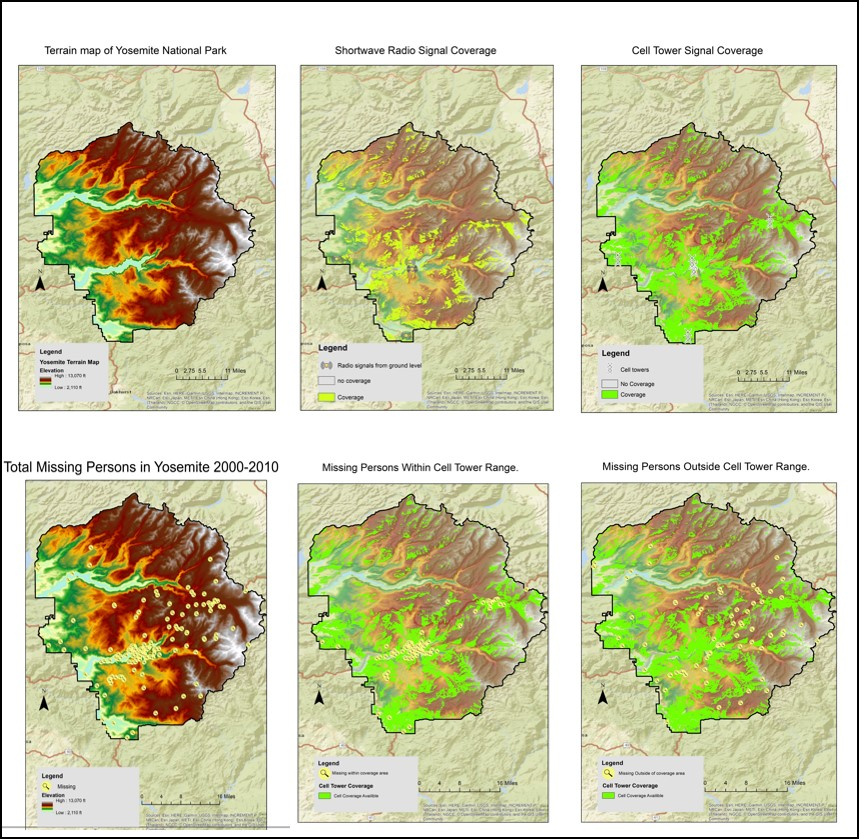
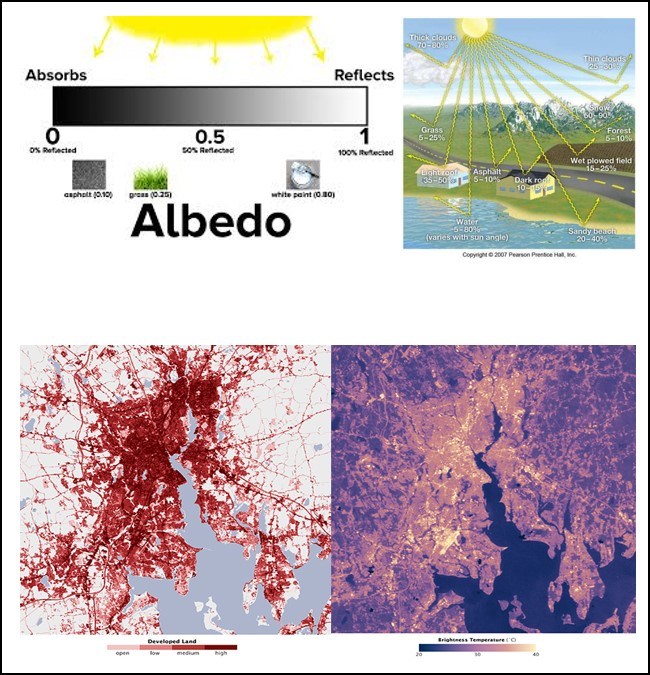
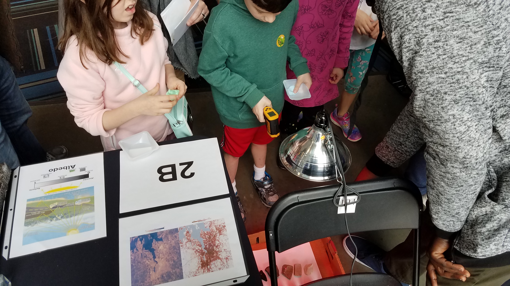
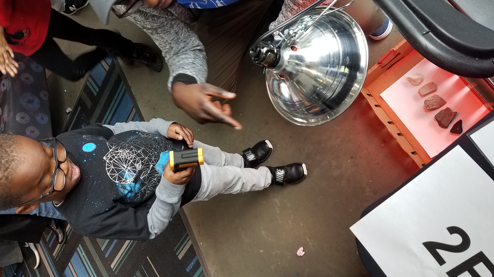

## Portfolio

---

### Projects

[Does Cell phone Coverage in National Parks Contribute to Missing Persons Reports ](/pdf/Powerpoint slide Final Draft.pdf)

In this project, digital elevation models were used to create an elevation map of Yosemite National Park. Which was further processed to create a viewshed analysis based on the cell tower locations and hieghts in the park to highlight areas were Cell service is available. I then used a data set of missing persons reports and found that about 60% of missing persons are lost within the cellular range. 

  

---

[Urban Heat Island Discovery Day](/pdf/MichaelhagenPoster 2019.pdf)

This project was to design a scientific presentation about geographical issues and design an interactive experiment. The topic and experiment was to show the effects of albedo and heat on the urban heat islands phenomenon that creates hotter conditions in cities during the summer. The experiment used a heat lamp on rock surfaces of varying shades of white to black. The children would use a laser thermometer on the rocks and see a noticeable difference in temperature based on the color and how much energy is absorbed based on the color of the material. 

 
 

---

[Analysis of Metro Atlanta's Housing Affordability](https://storymaps.arcgis.com/stories/334cbbcecc704f0a93b367694f5bb06f)

This project examined the housing affordability of the metro Atlanta area and analyzed potential areas that are in danger of not having a high degree of financial freedom or higher risk of forclosure. The data in earlier years were mostly incomplete from census the U.S. bureau so a temporal approach as intended did not come to fruition as an expected result. In the census blocks that did have a temporal relation the census blocks with the lowest median incomes seem to be paying up to 142% of their income on a mortgage in some extreme cases.    

  

)

---

Page template forked from <a href="https://github.com/evanca/quick-portfolio">evanca</a>

<!-- Remove above link if you don't want to attibute -->
