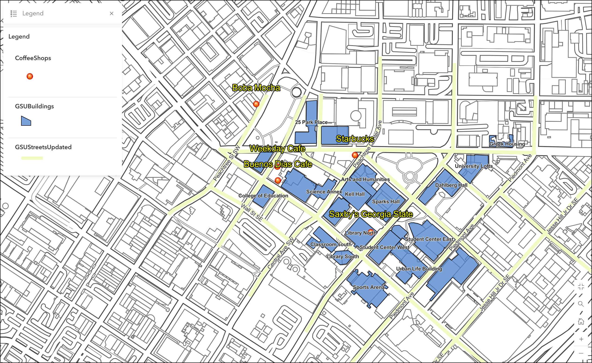

## Portfolio

---

### Projects

[Does Cell Phone Coverage in National Parks Contribute to Missing Persons Reports ](/pdf/Powerpoint slide Final Draft.pdf)

This project used digital elevation models to create an elevation map of Yosemite National Park. This was further processed to produce a viewshed analysis based on the cell tower locations and heights in the park to highlight areas where Cell service is available. I then used a data set of missing persons reports and found that about 60% of missing persons are lost within the cellular range. 

  

---

[Urban Heat Island Discovery Day](/pdf/MichaelhagenPoster 2019.pdf)

This project was to design a scientific presentation about geographical issues and plan an interactive experiment for a science fair. The topic and experiment were to show the effects of albedo and heat on the urban heat island phenomenon that creates hotter conditions in cities during the summer. The experiment used a heat lamp on rock surfaces of varying shades of white to black. The children would use a laser thermometer on the rocks and see a noticeable temperature difference based on the color and how much energy is absorbed based on the shade of the material. 

 
 

---

[Analysis of Metro Atlanta's Housing Affordability](https://storymaps.arcgis.com/stories/334cbbcecc704f0a93b367694f5bb06f)

This project examined the housing affordability of the metro Atlanta area and analyzed potential areas that are in danger of not having a high degree of financial freedom or a higher risk of foreclosure. The data in earlier years were mostly incomplete from the U.S. Census Bureau. A temporal approach was chosen. The lack of housing data before 2017 meant the project did not come to fruition as expected for the entirety of the study area. In the census blocks that did have a temporal relation the census blocks with the lowest median incomes seem to be paying up to 142% of their income on a mortgage in some extreme cases.    

  

---
[GSU Coffee Locations Map]

This project was a simple map of GSU Campus coffee shops available in the Downtown Atlanta area. 

---

[Before and After Northern California Fire 2019]

)

Page template forked from <a href="https://github.com/evanca/quick-portfolio">evanca</a>

<!-- Remove above link if you don't want to attibute -->
